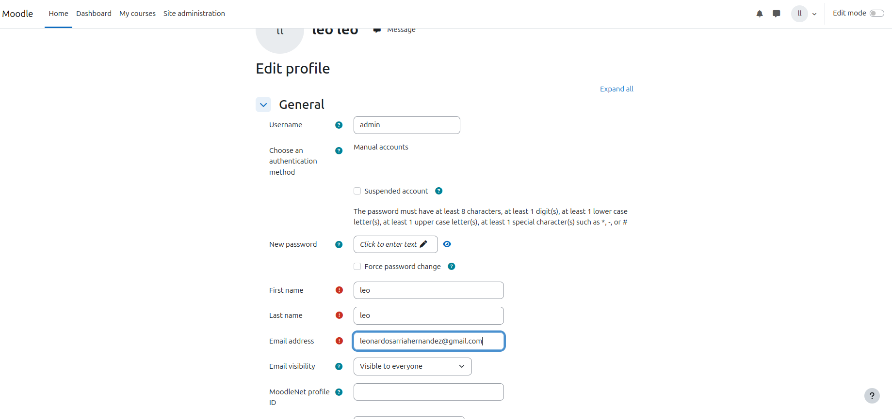

# Práctica-Tema-4-Instal-lació-i-Configuració-de-Moodle
# Configuración Inicial de Moodle

## 2. Administració inicial de Moodle

### 2.1. Administración del perfil de usuario

#### Cambiar correo electrónico y contraseña

En la siguiente imagen verás que cambié mi dirección de correo electrónico y mi contraseña.  

#### Añadir un avatar al perfil

Aquí se muestra cómo añadí un avatar a mi perfil en Moodle.  

---

### 2.2. Configuración del sitio

#### Cambiar el nombre del sitio

He cambiado el nombre largo y corto del sitio y he configurado la página principal para que no muestre contenido a los usuarios no autenticados.  

#### Ajustar la franja horaria

En esta imagen verás cómo ajusté la franja horaria del sitio para que las entregas de ejercicios se gestionen correctamente.  

#### Cambiar el idioma del sitio

He cambiado el idioma del sitio y he instalado los paquetes de idioma necesarios.  

#### Establecer una política de contraseñas robusta

Aquí puedes ver cómo configuré las políticas de contraseñas para que sean seguras (mínimo 8 caracteres, mayúsculas, minúsculas y números).  

---

## 3. Creación de cursos

#### Crear cursos A y B

He creado el curso "A" con 3 temas y el curso "B" con 5 temas.  

#### Añadir un documento PDF a un tema del curso A

He añadido un archivo PDF a uno de los temas del curso A.  

#### Cambiar el título de un tema

Aquí se muestra cómo cambié el título de uno de los temas dentro del curso A.  

---

## 4. Creación y gestión de usuarios

### 4.1. Creación manual de usuarios

#### Crear el usuario Bob

He creado manualmente un usuario llamado Bob con autenticación manual.  

### 4.2. Creación masiva de alumnos

#### Crear 10 alumnos mediante archivo CSV

Utilicé un archivo CSV para crear 10 alumnos en Moodle.  

#### Eliminar 2 alumnos

En la siguiente imagen verás cómo eliminé dos de los alumnos creados mediante las acciones en bloque.  

---

## 5. Matriculación de usuarios en los cursos

### 5.1. Configuración de métodos de inscripción

#### Curso A: Desactivar métodos de inscripción

He desactivado cualquier método de inscripción para que el curso A sea accesible sin necesidad de iniciar sesión.  

#### Curso B: Activar inscripción manual

He activado la inscripción manual para que el curso B requiera inicio de sesión y he matriculado a Bob como profesor y al resto como estudiantes.  

### 5.2. Verificación

#### Verificar accesibilidad del curso A

En la siguiente imagen puedes ver que el contenido del curso A es accesible públicamente, sin necesidad de iniciar sesión.  

#### Verificar accesibilidad del curso B

Aquí puedes comprobar que para acceder al curso B es necesario iniciar sesión.  

---

## 6. Personalización del sitio

#### Cambiar el aspecto del sitio

He descargado y activado un tema nuevo.  

#### Modificar la cabecera, pie de página y página principal

He realizado modificaciones en la cabecera, pie de página y la página principal de Moodle.  

#### Añadir un logotipo al sitio

He añadido un logotipo al sitio de Moodle.  

---

## 7. Creación de contenidos y actividades

### 7.1. Curso A

#### Asignar un profesor y matricular alumnos

He asignado un profesor y matriculado a los alumnos en el curso A.  

#### Añadir actividades y recursos

Añadí varios tipos de actividades y recursos en el curso A.  

#### Crear una tarea con fecha de entrega

He creado una tarea con fecha de entrega abierta que permite la carga de un archivo PDF.  

### 7.2. Curso B

#### Clonar contenido del curso A al curso B

He clonado el contenido del curso A al curso B utilizando la función de importación.  

---

## 8. Calificaciones e insignias

#### Completar tareas evaluables

He completado todas las tareas evaluables con un usuario alumno.  

